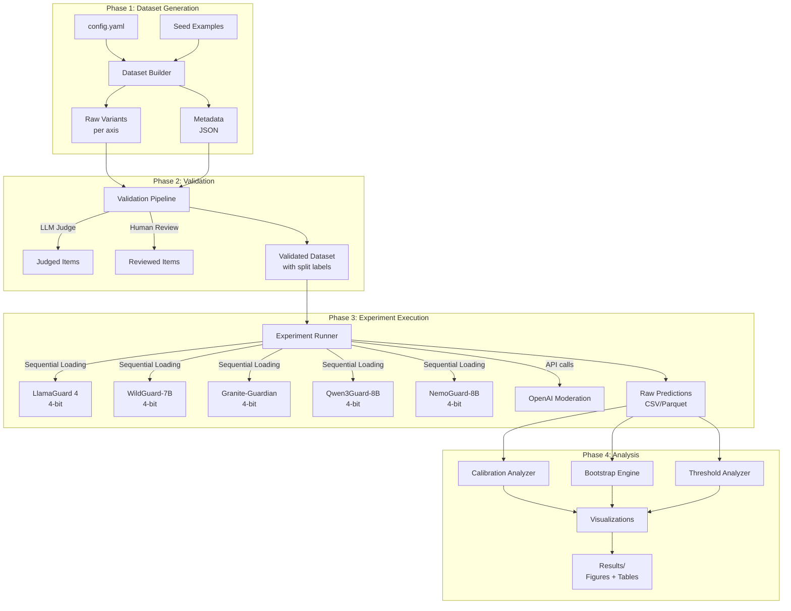
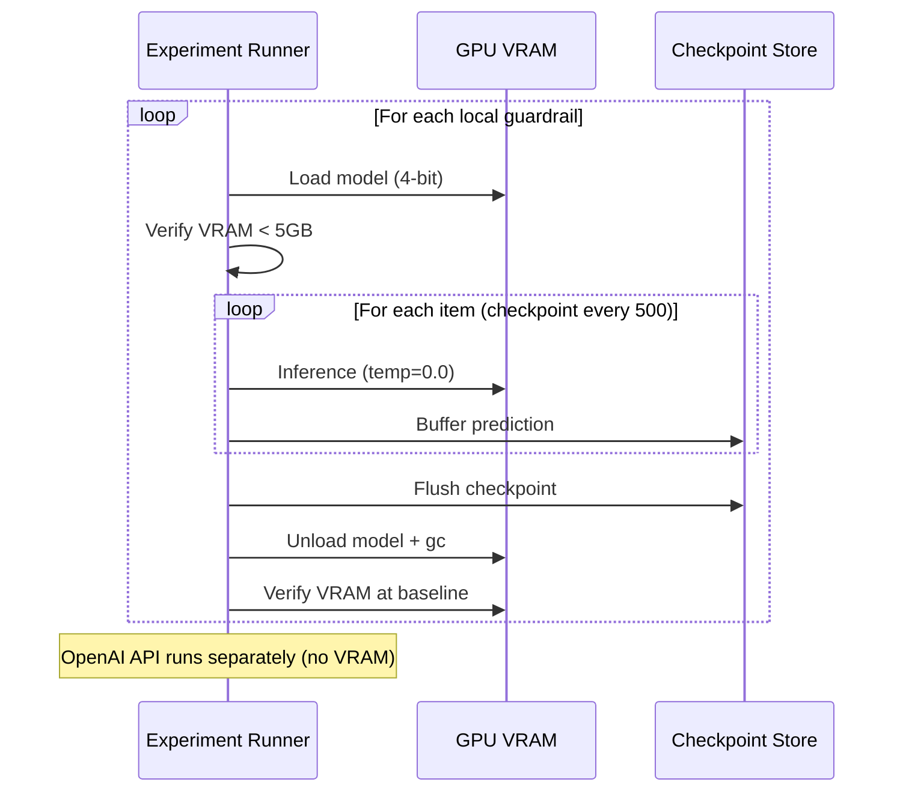
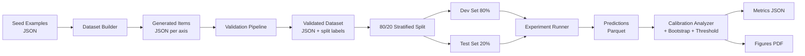

# Design Document: Guardrail Calibration Evaluation Framework

## Overview

This framework measures whether LLM safety guardrail confidence scores remain calibrated under controlled synthetic distribution shift, targeting APAC deployment contexts. The system evaluates 5 open-source guardrails (4-bit quantized) and 1 commercial API guardrail across 5 distribution shift axes, producing calibration curves, ECE with bootstrap CIs, Brier Score decomposition, and operational threshold analysis.

The core insight driving this design: companies set auto-block thresholds based on confidence scores, but nobody has systematically measured whether those scores are reliable under distribution shift. A guardrail reporting 0.9 confidence should be correct ~90% of the time — this framework measures whether that holds.

### Key Design Decisions

1. **Three-way confidence source stratification**: `logits_softmax`, `native_safety_score`, and `api_score` are treated as distinct confidence source types. Models within the same type are comparable; cross-type comparisons require explicit caveats. OpenAI Moderation is a separate practitioner reference.
2. **2-token probability mass reporting and filtering**: All logit-based adapters report raw 2-token mass vs full vocabulary. When mass < 0.5, the normalized confidence is flagged as artificially inflated. The CalibrationAnalyzer computes metrics both with and without low-mass items, and reports the fraction of items affected.
3. **Axis 3 is fundamentally different**: Uses graded harmfulness + Spearman correlation, not binary ECE. Indirection genuinely changes risk profile.
4. **Adaptive bin count**: M = max(5, min(15, floor(N/15))) prevents bin starvation on small subsets.
5. **All local model results are for "4-bit quantized versions"**: Quantization affects logit distributions and therefore calibration. A quantization impact baseline (Req 8b) measures this effect.
6. **Brier Score uncertainty fixed at 0.25**: Forced 50/50 balance means the uncertainty component is constant — focus is on calibration + resolution.
7. **Prompt templating**: Each adapter applies model-specific chat templates before inference. Raw text is never passed directly to instruction-tuned models.
8. **Atomic checkpointing**: Write-then-rename pattern prevents Parquet corruption on crash.
9. **Class-conditional ECE in primary results**: Both overall and class-conditional ECE are required outputs in all primary results tables and visualizations.

## Architecture

The system follows a pipeline architecture with four sequential phases: Dataset Generation → Validation → Experiment Execution → Analysis & Visualization. Each phase produces persisted artifacts consumed by the next.



### Sequential Model Loading

Only one local model occupies VRAM at a time. The Experiment Runner loads a model, runs all items through it, checkpoints results, unloads the model, verifies VRAM baseline, then loads the next. This enables running all 8B models on a single GPU (e.g., Mac Studio).




## Components and Interfaces

### 1. Guardrail Adapter Interface (`src/guardrails/base.py`)

Abstract base class that all guardrail adapters implement. The interface enforces uniform output format while accommodating heterogeneous confidence sources.

```python
from abc import ABC, abstractmethod
from dataclasses import dataclass
from typing import Literal

@dataclass
class PredictionResult:
    label: Literal["harmful", "benign"]
    confidence_score: float          # 0.0-1.0, normalized
    two_token_mass: float | None     # Raw 2-token probability mass (logit-based only)
    raw_logits: dict[str, float] | None  # {"safe_logit": prob, "unsafe_logit": prob} (logit-based only)

class GuardrailAdapter(ABC):
    @abstractmethod
    def predict(self, text: str) -> PredictionResult:
        """Classify text and return prediction with confidence.
        Applies model-specific chat template before inference.
        Raises ValueError for empty/null input."""
        ...

    @abstractmethod
    def format_prompt(self, text: str) -> str:
        """Apply model-specific chat template to raw text.
        Each model requires a specific prompt format (e.g., LlamaGuard
        uses <|start_header_id|>user<|end_header_id|> format).
        Raw text must NEVER be passed directly to instruction-tuned models."""
        ...

    @abstractmethod
    def get_model_name(self) -> str:
        """Return display name, e.g. 'LlamaGuard 4 (4-bit)'."""
        ...

    @property
    @abstractmethod
    def confidence_source(self) -> Literal[
        "logits_softmax", "native_safety_score", "category_scores"
    ]:
        """How the confidence score is derived."""
        ...

    @property
    def confidence_source_type(self) -> Literal["logits_softmax", "native_safety_score", "api_score"]:
        """Three-way stratification key for cross-model analysis.
        logits_softmax and native_safety_score are NOT directly comparable
        because they derive confidence from fundamentally different mechanisms."""
        return self.confidence_source if self.confidence_source != "category_scores" else "api_score"

    @abstractmethod
    def load_model(self) -> None:
        """Load model into VRAM/memory."""
        ...

    @abstractmethod
    def unload_model(self) -> None:
        """Fully unload model from VRAM/memory."""
        ...
```

**Design rationale**: `PredictionResult` includes `two_token_mass` to satisfy Req 1.7 — when this value is < 0.5, the adapter logs a warning because the 2-token normalized confidence is artificially inflated. The `raw_logits` field uses semantic keys (`safe_logit`, `unsafe_logit`) instead of stringified token IDs for downstream readability. The `format_prompt` method ensures each adapter applies its model-specific chat template before inference — passing raw text to instruction-tuned models would cause formatting-induced failures that look like miscalibration but are actually template errors. The `confidence_source_type` uses three-way stratification because `logits_softmax` and `native_safety_score` derive confidence from fundamentally different mechanisms and should not be treated as comparable.

### 2. Logit-Based Adapter Mixin (`src/guardrails/base.py`)

Shared logic for all 5 open-source models that derive confidence from token logits.

```python
class LogitBasedAdapterMixin:
    """Mixin for adapters that derive confidence from logit softmax."""

    # Subclasses set these to model-specific token IDs
    safe_token_id: int
    unsafe_token_id: int

    def verify_token_mapping(self, tokenizer) -> None:
        """Verify that mapped token IDs actually decode to expected tokens.
        Must be called at initialization. Raises ValueError if mapping is wrong."""
        safe_decoded = tokenizer.decode([self.safe_token_id]).strip().lower()
        unsafe_decoded = tokenizer.decode([self.unsafe_token_id]).strip().lower()
        logger.info(f"Token mapping: safe={self.safe_token_id} -> '{safe_decoded}', "
                     f"unsafe={self.unsafe_token_id} -> '{unsafe_decoded}'")
        # Check for common case-sensitivity issues (e.g., "Yes" vs "yes")
        # Subclasses should override expected_tokens if needed
        expected_safe = getattr(self, 'expected_safe_token', None)
        expected_unsafe = getattr(self, 'expected_unsafe_token', None)
        if expected_safe and safe_decoded != expected_safe.lower():
            raise ValueError(f"Safe token ID {self.safe_token_id} decodes to "
                           f"'{safe_decoded}', expected '{expected_safe}'")
        if expected_unsafe and unsafe_decoded != expected_unsafe.lower():
            raise ValueError(f"Unsafe token ID {self.unsafe_token_id} decodes to "
                           f"'{unsafe_decoded}', expected '{expected_unsafe}'")

    def compute_confidence(self, logits: torch.Tensor) -> PredictionResult:
        """Apply full-vocabulary softmax, extract 2-token mass,
        then normalize to get confidence score.
        Logs warning if 2-token mass < 0.5."""
        full_softmax = torch.softmax(logits, dim=-1)
        safe_prob = full_softmax[self.safe_token_id].item()
        unsafe_prob = full_softmax[self.unsafe_token_id].item()
        two_token_mass = safe_prob + unsafe_prob

        if two_token_mass < 0.5:
            logger.warning(
                f"2-token mass={two_token_mass:.4f} < 0.5 — "
                "normalized confidence is artificially inflated"
            )

        # Normalize to 2-token distribution
        normalized_unsafe = unsafe_prob / two_token_mass
        normalized_safe = safe_prob / two_token_mass

        label = "harmful" if normalized_unsafe > normalized_safe else "benign"
        confidence = max(normalized_unsafe, normalized_safe)

        return PredictionResult(
            label=label,
            confidence_score=confidence,
            two_token_mass=two_token_mass,
            raw_logits={
                "safe_logit": safe_prob,
                "unsafe_logit": unsafe_prob,
            },
        )
```

**Design rationale**: The mixin centralizes the 2-token softmax truncation logic (Req 1.6, 1.7). Each concrete adapter only needs to set `safe_token_id` and `unsafe_token_id` at initialization and call `verify_token_mapping()` to confirm the IDs decode to the expected tokens. The `raw_logits` dict uses semantic keys (`safe_logit`, `unsafe_logit`) instead of stringified token IDs, so downstream analysts can read the Parquet files without needing to look up model-specific token vocabularies. The `verify_token_mapping` method catches case-sensitivity issues (e.g., Granite's "Yes" vs "yes") at initialization time rather than producing silently wrong results.

### 3. Concrete Adapters (`src/guardrails/`)

Each adapter follows the same pattern:

| Adapter | Model | Confidence Source | Token Mapping | Prompt Template |
|---------|-------|-------------------|---------------|-----------------|
| `LlamaGuardAdapter` | meta-llama/Llama-Guard-4-8B | logits_softmax | safe/unsafe token IDs from tokenizer | LlamaGuard chat template with `<\|start_header_id\|>` format |
| `WildGuardAdapter` | allenai/wildguard | native_safety_score | Model's built-in safety score (see caveat below) | WildGuard-specific prompt format |
| `GraniteGuardianAdapter` | ibm-granite/granite-guardian-3.3-8b | logits_softmax | yes/no token IDs mapped to benign/harmful (case-verified) | Granite chat template |
| `Qwen3GuardAdapter` | Qwen/Qwen3Guard-8B | logits_softmax | safe/unsafe token IDs from tokenizer | Qwen chat template |
| `NemoGuardAdapter` | nvidia/Llama-3.1-8B-Instruct-NemoGuard | logits_softmax | safe/unsafe token IDs from tokenizer | Llama-3.1 chat template |
| `OpenAIModerationAdapter` | OpenAI Moderation API | category_scores | N/A (API returns scores directly) | N/A (API handles formatting) |

**WildGuard native_safety_score caveat**: WildGuard outputs a native safety score that is NOT derived from 2-token logit softmax. The adapter must document what this score represents (per the model card) and whether it has probabilistic semantics. If the score is not a proper probability, this must be noted in the results and WildGuard must be analyzed separately from the logits_softmax models. The three-way `confidence_source_type` stratification ensures WildGuard is never directly compared with logits_softmax models without caveats.

**GraniteGuardian token mapping caveat**: Granite uses "yes"/"no" tokens. The adapter must call `verify_token_mapping()` at initialization to confirm the mapped IDs decode to the expected tokens, catching case-sensitivity issues (e.g., "Yes" vs "yes" in the vocabulary).

All local adapters:
- Load in 4-bit quantization via `bitsandbytes` (BnB) with `load_in_4bit=True`
- Log quantization config and VRAM footprint at initialization
- Use `temperature=0.0` (greedy decoding) for deterministic inference
- Apply model-specific chat template via `format_prompt()` before inference
- Report display name as `"{Model} (4-bit)"`
- Log hardware/software versions at initialization: torch version, bitsandbytes version, CUDA/MPS backend version

The `OpenAIModerationAdapter` handles retry logic (3 retries, exponential backoff) and documents that `category_scores` are NOT probabilities.

### 4. Dataset Builder (`src/datasets/builder.py`)

Responsible for generating distribution-shifted variants across all 5 axes.

```python
@dataclass
class DatasetItem:
    item_id: str           # Unique across entire dataset
    seed_id: str           # Shared across variants of same seed
    axis: int              # 1-5
    shift_level: int       # 0-4
    ground_truth: str      # "harmful" or "benign" (Axes 1,2,4,5)
    graded_harmfulness: float | None  # 0.0-1.0 (Axis 3 only)
    seed_text: str
    variant_text: str
    generation_method: str
    validation_status: str  # "validated", "disputed", "ambiguous"
    cultural_frame: str | None  # Axis 2 only
    token_counts: dict[str, int] | None  # Axis 5: model_name -> token_count
    split: Literal["dev", "test"]  # 80/20 stratified split

class DatasetBuilder:
    def generate_axis1_register(self, seeds: list[SeedExample]) -> list[DatasetItem]: ...
    def generate_axis2_cultural(self, seeds: list[SeedExample]) -> list[DatasetItem]: ...
    def generate_axis3_indirection(self, seeds: list[SeedExample]) -> list[DatasetItem]: ...
    def generate_axis4_domain(self, seeds: list[SeedExample]) -> list[DatasetItem]: ...
    def generate_axis5_language(self, seeds: list[SeedExample]) -> list[DatasetItem]: ...
    def split_dataset(self, items: list[DatasetItem]) -> tuple[list[DatasetItem], list[DatasetItem]]: ...
    def validate_class_balance(self, items: list[DatasetItem], axis: int) -> BalanceReport: ...
```

**Axis-specific generation details**:

- **Axis 1 (Register)**: 50-100 harmful + 50-100 benign seeds → 4-5 register variants each → ~200-500 items. 50/50 balance per shift_level.
- **Axis 2 (Cultural/APAC)**: 30-40 harmful + 30-40 benign seeds → cultural frames (filial piety, traditional medicine, cultural idioms, Singlish). Tagged with specific cultural frame. Dual human review with Cohen's kappa.
- **Axis 3 (Directness)**: 100 harmful seeds → 5 indirection levels → ~500 items + 50 benign refusals subset. Graded harmfulness (0.0-1.0) from 2 annotators with inter-rater reliability.
- **Axis 4 (Domain)**: 100 harmful + 100 benign seeds → 4 domains → ~800 items. Includes APAC public sector language.
- **Axis 5 (Language)**: 200-item English subset → Malay, Mandarin (Simplified), Indonesian → ~800 items. Professional translation with native speaker review. Token counts recorded per model.

### 5. Validation Pipeline (`src/datasets/validator.py`)

```python
class ValidationPipeline:
    def validate_with_llm_judge(
        self, items: list[DatasetItem], judge_model: str
    ) -> list[DatasetItem]:
        """Use a DIFFERENT LLM from the generator as judge.
        Flags disagreements as 'disputed'."""
        ...

    def compute_judge_error_rate(
        self, judge_results: list, human_results: list
    ) -> float:
        """Compare judge against human-reviewed sample."""
        ...

    def select_human_review_sample(
        self, items: list[DatasetItem], fraction: float = 0.20
    ) -> list[DatasetItem]:
        """Stratified 20% sample across ALL axes."""
        ...

    def compute_inter_rater_reliability(
        self, ratings_a: list, ratings_b: list, metric: str = "cohens_kappa"
    ) -> float:
        """Cohen's kappa for Axis 2, Spearman for Axis 3."""
        ...
```

### 6. Experiment Runner (`src/evaluation/runner.py`)

Orchestrates the factorial experiment with sequential model loading and checkpointing.

```python
class ExperimentRunner:
    def run_sanity_check(self, subset: list[DatasetItem]) -> SanityCheckReport:
        """100-item check: score distributions, accuracy, histogram coverage."""
        ...

    def run_pilot(self, subset: list[DatasetItem]) -> PilotReport:
        """200-item pilot with LlamaGuard 4 + Qwen3Guard-8B on Axes 1,5."""
        ...

    def run_full_experiment(self, dataset: list[DatasetItem]) -> None:
        """Full factorial: 6 guardrails × ~10k items, checkpointed."""
        ...

    def run_quantization_baseline(self, subset: list[DatasetItem]) -> QuantBaselineReport:
        """LlamaGuard 4 in 4-bit vs fp16 on 500-item subset."""
        ...

    def _load_and_run(self, adapter: GuardrailAdapter, items: list[DatasetItem]) -> list[Prediction]:
        """Load model, run all items, checkpoint every 500, unload."""
        ...

    def _atomic_checkpoint(self, predictions: list[Prediction], path: str) -> None:
        """Write predictions to path.tmp, then os.rename to path.
        Prevents Parquet corruption if process is killed during write."""
        ...

    def _run_api_canary_check(self, canary_items: list[DatasetItem]) -> CanaryCheckResult:
        """Run 5-10 stable canary items through OpenAI API at start, middle,
        and end of the 48-hour window. Compare scores across runs.
        If any canary score drifts by > 0.05, flag potential API version change."""
        ...

    def verify_completeness(self, dataset: list[DatasetItem], predictions: list[Prediction]) -> CompletenessReport:
        """After experiment, verify all item_ids in dataset have corresponding
        predictions. Report any missing items and whether skipped items
        are randomly distributed or systematically biased (e.g., longer inputs)."""
        ...
```

### 7. Calibration Analyzer (`src/evaluation/calibration.py`)

```python
class CalibrationAnalyzer:
    def compute_adaptive_bin_count(self, n: int) -> int:
        """M = max(5, min(15, floor(N/15)))"""
        ...

    def compute_calibration_curve(
        self, predictions: list[Prediction], n_bins: int | None = None
    ) -> CalibrationCurve:
        """Equal-width binning (primary) + adaptive binning."""
        ...

    def compute_ece(self, predictions: list[Prediction]) -> ECEResult:
        """Weighted average |confidence - accuracy| across bins."""
        ...

    def compute_class_conditional_ece(
        self, predictions: list[Prediction]
    ) -> ClassConditionalECE:
        """Separate ECE for harmful-class and benign-class predictions.
        REQUIRED in all primary results tables and visualizations."""
        ...

    def compute_brier_score(self, predictions: list[Prediction]) -> BrierDecomposition:
        """Brier = calibration + resolution - uncertainty (uncertainty=0.25)."""
        ...

    def compute_spearman_correlation(
        self, confidence_scores: list[float], graded_harmfulness: list[float]
    ) -> SpearmanResult:
        """Axis 3 only: confidence vs graded harmfulness."""
        ...

    def compute_delta_metrics(
        self, predictions_base: list[Prediction], predictions_shifted: list[Prediction]
    ) -> DeltaMetrics:
        """ΔAccuracy and ΔECE between shift_level=0 and max."""
        ...

    def run_sensitivity_analysis(
        self, predictions: list[Prediction], exclude_status: str = "ambiguous"
    ) -> SensitivityReport:
        """Re-compute metrics with ambiguous items excluded."""
        ...

    def compute_two_token_mass_summary(
        self, predictions: list[Prediction]
    ) -> TwoTokenMassSummary:
        """Compute aggregate statistics of two_token_mass across predictions:
        mean, std, fraction below 0.5 threshold.
        REQUIRED in all results outputs for logit-based models."""
        ...

    def compute_ece_excluding_low_mass(
        self, predictions: list[Prediction], mass_threshold: float = 0.5
    ) -> ECEResult:
        """Compute ECE on the 'clean' subset where two_token_mass >= threshold.
        Report alongside the full-dataset ECE to show the impact of
        artificially inflated confidence scores."""
        ...

    def compute_token_length_correlation(
        self, predictions: list[Prediction], items: list[DatasetItem]
    ) -> TokenLengthAnalysis:
        """Axis 5 only: compute Spearman correlation between token count
        and confidence score, and between token count and prediction correctness.
        Isolates tokenizer fragmentation effects from semantic miscalibration.
        REQUIRED for Axis 5 results."""
        ...
```

### 8. Bootstrap Engine (`src/evaluation/bootstrap.py`)

```python
class BootstrapEngine:
    def compute_ci(
        self, data: list, metric_fn: Callable, n_resamples: int = 2000, alpha: float = 0.05
    ) -> ConfidenceInterval:
        """Bootstrap CI for any metric function."""
        ...

    def pairwise_mcnemar(
        self, predictions_a: list[Prediction], predictions_b: list[Prediction]
    ) -> McNemarResult:
        """McNemar's test for paired accuracy comparison."""
        ...

    def apply_holm_bonferroni(self, p_values: list[float]) -> list[CorrectedPValue]:
        """Step-down correction for multiple comparisons."""
        ...
```

### 9. Threshold Analyzer (`src/evaluation/thresholds.py`)

```python
class ThresholdAnalyzer:
    def compute_precision_recall_at_thresholds(
        self, predictions: list[Prediction], thresholds: list[float] = [0.80, 0.90, 0.95]
    ) -> list[ThresholdMetrics]:
        """Precision/recall at each threshold."""
        ...

    def compute_honest_threshold(
        self, predictions: list[Prediction], target_precisions: list[float] = [0.80, 0.90, 0.95]
    ) -> list[HonestThreshold]:
        """Confidence needed to achieve target precision."""
        ...

    def compute_worst_case_threshold(
        self, per_condition_thresholds: dict[str, list[HonestThreshold]]
    ) -> list[HonestThreshold]:
        """Max confidence needed across all conditions."""
        ...
```

### 10. Visualization Module (`src/analysis/plots.py`)

```python
class PlotGenerator:
    def plot_ece_vs_shift(self, results: AxisResults) -> Figure:
        """ECE vs shift_level, one line per guardrail, 95% CI bands."""
        ...

    def plot_reliability_heatmap(self, results: FullResults) -> Figure:
        """Guardrails × Axes heatmap, ECE as color."""
        ...

    def generate_honest_threshold_table(self, results: FullResults) -> DataFrame:
        """Per-guardrail, per-axis honest thresholds. Logit/API separated."""
        ...

    def plot_apac_language_comparison(self, results: Axis5Results) -> Figure:
        """ECE, Brier, precision-at-threshold across EN/MS/ZH/ID."""
        ...
```


## Data Models

### Core Data Structures

```python
from dataclasses import dataclass, field
from typing import Literal
import json

# --- Dataset Layer ---

@dataclass
class SeedExample:
    seed_id: str
    text: str
    ground_truth: Literal["harmful", "benign"]
    source: str  # e.g., "ToxiGen", "OpenAI Moderation Dataset"

@dataclass
class DatasetItem:
    item_id: str
    seed_id: str
    axis: int                          # 1-5
    shift_level: int                   # 0-4
    ground_truth: Literal["harmful", "benign"]  # Axes 1,2,4,5
    graded_harmfulness: float | None   # Axis 3 only (0.0-1.0)
    seed_text: str
    variant_text: str
    generation_method: str             # e.g., "gpt-4o-mini", "human_translation"
    validation_status: Literal["validated", "disputed", "ambiguous", "pending"]
    cultural_frame: str | None         # Axis 2 only
    token_counts: dict[str, int] | None  # Axis 5: {model_name: count}
    split: Literal["dev", "test"]
    western_norm_flag: bool = False     # True if translation introduced ambiguity

    def to_json(self) -> str:
        """Serialize to JSON string."""
        return json.dumps(self.__dict__, ensure_ascii=False, sort_keys=True)

    @classmethod
    def from_json(cls, json_str: str) -> "DatasetItem":
        """Deserialize from JSON string."""
        return cls(**json.loads(json_str))

# --- Prediction Layer ---

@dataclass
class PredictionResult:
    label: Literal["harmful", "benign"]
    confidence_score: float
    two_token_mass: float | None       # Logit-based only
    raw_logits: dict[str, float] | None  # {"safe_logit": prob, "unsafe_logit": prob}

@dataclass
class Prediction:
    guardrail_name: str
    item_id: str
    predicted_label: Literal["harmful", "benign"]
    confidence_score: float
    inference_time_ms: float
    two_token_mass: float | None
    confidence_source_type: Literal["logits_softmax", "native_safety_score", "api_score"]
    split: Literal["dev", "test"]

# --- Metrics Layer ---

@dataclass
class CalibrationCurve:
    bin_edges: list[float]
    bin_counts: list[int]
    mean_confidence: list[float]
    actual_accuracy: list[float]
    binning_method: Literal["equal_width", "adaptive"]

@dataclass
class ECEResult:
    ece: float
    ci_lower: float
    ci_upper: float
    n_bins: int
    n_items: int

@dataclass
class ClassConditionalECE:
    harmful_ece: ECEResult
    benign_ece: ECEResult
    overall_ece: ECEResult

@dataclass
class BrierDecomposition:
    brier_score: float
    calibration: float
    resolution: float
    uncertainty: float  # Fixed at 0.25 for 50/50 balance

@dataclass
class SpearmanResult:
    correlation: float
    p_value: float
    n_items: int

@dataclass
class HonestThreshold:
    target_precision: float
    honest_confidence: float  # Confidence needed to achieve target
    actual_precision_at_target: float
    guardrail: str
    axis: int
    shift_level: int

@dataclass
class DeltaMetrics:
    delta_accuracy: float
    delta_accuracy_ci: tuple[float, float]
    delta_ece: float
    delta_ece_ci: tuple[float, float]
    guardrail: str
    axis: int

@dataclass
class SanityCheckReport:
    guardrail: str
    mean: float
    std: float
    min_score: float
    max_score: float
    skewness: float
    kurtosis: float
    bins_covered: int       # Out of 10
    accuracy: float
    passed: bool
    warnings: list[str]

@dataclass
class TwoTokenMassSummary:
    mean_mass: float
    std_mass: float
    fraction_below_threshold: float  # Fraction of items with mass < 0.5
    n_items: int
    threshold: float = 0.5

@dataclass
class TokenLengthAnalysis:
    correlation_with_confidence: float  # Spearman: token_count vs confidence
    correlation_with_correctness: float  # Spearman: token_count vs correct/incorrect
    p_value_confidence: float
    p_value_correctness: float
    mean_token_ratio: float  # Mean(non-English tokens / English tokens) per seed

@dataclass
class CanaryCheckResult:
    canary_items: list[str]  # item_ids used as canaries
    max_score_drift: float   # Max absolute score change across runs
    drift_detected: bool     # True if any drift > 0.05
    timestamps: list[str]    # UTC timestamps of each canary run

@dataclass
class CompletenessReport:
    total_expected: int
    total_found: int
    missing_item_ids: list[str]
    skipped_item_analysis: dict  # Distribution stats of skipped items

# --- Experiment Configuration ---

@dataclass
class ExperimentConfig:
    guardrails: list[str]
    axes: list[int]
    bootstrap_resamples: int = 2000
    operational_thresholds: list[float] = field(default_factory=lambda: [0.80, 0.90, 0.95])
    checkpoint_frequency: int = 500
    sanity_check_size: int = 100
    pilot_guardrails: list[str] = field(default_factory=lambda: ["llamaguard4", "qwen3guard"])
    pilot_axes: list[int] = field(default_factory=lambda: [1, 5])
    pilot_size: int = 200
    quantization_baseline_size: int = 500
    temperature: float = 0.0
    api_snapshot_window_hours: int = 48

    @classmethod
    def from_yaml(cls, path: str) -> "ExperimentConfig":
        """Load and validate config from YAML file."""
        ...

    def validate(self) -> list[str]:
        """Return list of validation errors (empty = valid).
        Enforces semantic ranges in addition to type checks:
        - bootstrap_resamples >= 500
        - checkpoint_frequency >= 100
        - temperature in [0.0, 1.0]
        - api_snapshot_window_hours >= 12
        - all thresholds in (0.0, 1.0)
        - guardrails list non-empty
        - axes list non-empty and all values in {1,2,3,4,5}"""
        ...
```

### Persistence Format

| Artifact | Format | Location |
|----------|--------|----------|
| Dataset items | JSON (one file per axis) | `data/generated/axis_{n}.json` |
| Validated dataset | JSON | `data/annotated/validated_dataset.json` |
| Metadata | JSON | `data/annotated/metadata.json` |
| Raw predictions | Parquet (primary) + CSV (backup) | `results/predictions/` |
| Calibration metrics | JSON | `results/metrics/` |
| Figures | PDF (vector) | `results/figures/` |
| Experiment config | YAML | `config.yaml` |
| Checkpoints | Parquet | `results/checkpoints/` |

### Data Flow




## Correctness Properties

*A property is a characteristic or behavior that should hold true across all valid executions of a system — essentially, a formal statement about what the system should do. Properties serve as the bridge between human-readable specifications and machine-verifiable correctness guarantees.*

### Property 1: Adapter output contract

*For any* non-empty text input and any GuardrailAdapter implementation, `predict(text)` must return a `PredictionResult` where `label` is in `{"harmful", "benign"}` and `confidence_score` is in `[0.0, 1.0]`.

**Validates: Requirements 1.1**

### Property 2: Confidence source type derivation

*For any* GuardrailAdapter, if `confidence_source` is `"logits_softmax"` or `"native_safety_score"` then `confidence_source_type` must be `"logit_based"`, and if `confidence_source` is `"category_scores"` then `confidence_source_type` must be `"api_score"`.

**Validates: Requirements 1.5**

### Property 3: Two-token probability mass invariant

*For any* logit-based adapter prediction, `two_token_mass` must be non-null, must be in `(0.0, 1.0]`, and must equal the sum of the safe and unsafe token probabilities from the full-vocabulary softmax. The normalized `confidence_score` must equal `max(safe_prob, unsafe_prob) / two_token_mass`.

**Validates: Requirements 1.7**

### Property 4: Metadata JSON round-trip

*For any* valid `DatasetItem`, serializing to JSON via `to_json()` then deserializing via `from_json()` must produce an object equal to the original.

**Validates: Requirements 14.4, 14.5**

### Property 5: Prediction persistence round-trip

*For any* valid predictions file, reading the file then writing it back must produce a byte-identical file.

**Validates: Requirements 29.3**

### Property 6: Ground truth preservation across variants

*For any* set of dataset items in Axes 1, 2, 4, or 5 that share the same `seed_id`, all items must have the same `ground_truth` label.

**Validates: Requirements 9.3, 10.3, 12.3, 13.3**

### Property 7: Shift level range

*For any* dataset item, `shift_level` must be in `{0, 1, 2, 3, 4}`.

**Validates: Requirements 9.2, 11.3**

### Property 8: Class balance per shift level

*For any* axis in `{1, 2, 4, 5}` and any `shift_level`, the proportion of harmful items must be between 0.35 and 0.65 (approximately 50/50 with tolerance for small subsets).

**Validates: Requirements 9.5, 10.5, 12.5**

### Property 9: Axis-specific required fields

*For any* Axis 2 dataset item, `cultural_frame` must be non-null. *For any* Axis 3 dataset item, `graded_harmfulness` must be non-null and in `[0.0, 1.0]`. *For any* Axis 5 dataset item, `token_counts` must be non-null and contain an entry for each evaluated model.

**Validates: Requirements 10.4, 11.5, 13.7**

### Property 10: Unique item IDs

*For any* complete dataset, all `item_id` values must be unique (no duplicates).

**Validates: Requirements 14.2**

### Property 11: Dataset metadata completeness

*For any* dataset item, the fields `item_id`, `seed_id`, `axis`, `shift_level`, `ground_truth`, `seed_text`, `variant_text`, `generation_method`, and `validation_status` must all be non-null.

**Validates: Requirements 14.1**

### Property 12: Prediction record completeness

*For any* prediction record, the fields `guardrail_name`, `item_id`, `predicted_label`, `confidence_score`, `inference_time_ms`, `confidence_source_type`, and `split` must all be non-null, with `confidence_score` in `[0.0, 1.0]` and `inference_time_ms >= 0`.

**Validates: Requirements 18.2**

### Property 13: Stratified split preserves proportions

*For any* dataset split into dev (80%) and test (20%) sets, the proportion of each `(axis, shift_level, ground_truth)` stratum in the test set must be within 10 percentage points of its proportion in the full dataset.

**Validates: Requirements 18a.1**

### Property 14: Adaptive bin count formula

*For any* positive integer N, the adaptive bin count must equal `max(5, min(15, floor(N / 15)))`.

**Validates: Requirements 19.1**

### Property 15: ECE computation correctness

*For any* set of predictions grouped into bins, ECE must equal the weighted average of `|mean_confidence_in_bin - actual_accuracy_in_bin|` where weights are `bin_count / total_count`.

**Validates: Requirements 20.1**

### Property 16: Class-conditional ECE decomposition

*For any* set of predictions, the class-conditional ECE for harmful-class predictions must equal ECE computed only on predictions where `predicted_label == "harmful"`, and similarly for benign-class. The overall ECE must be recoverable as the weighted combination of the two.

**Validates: Requirements 20.5**

### Property 17: Bootstrap CI coverage

*For any* dataset and metric function, the 95% bootstrap confidence interval computed from 2000 resamples must contain the point estimate computed on the original data.

**Validates: Requirements 20.2, 24.2**

### Property 18: Brier Score decomposition invariant

*For any* set of predictions with binary outcomes, the Brier Score must equal `calibration - resolution + uncertainty`, where each component is non-negative and `uncertainty = base_rate * (1 - base_rate)`.

**Validates: Requirements 21.1, 21.2, 21.5**

### Property 19: Precision at threshold monotonicity

*For any* set of predictions, precision at threshold `t1` must be greater than or equal to precision at threshold `t2` when `t1 > t2` (higher confidence thresholds yield equal or higher precision).

**Validates: Requirements 22.1**

### Property 20: Honest threshold correctness

*For any* set of predictions and target precision `p`, the honest threshold `t` must be the minimum confidence value such that precision at `t` >= `p`. The worst-case honest threshold across conditions must equal the maximum of per-condition honest thresholds.

**Validates: Requirements 22.2, 22.4**

### Property 21: Holm-Bonferroni correction ordering

*For any* list of p-values, the Holm-Bonferroni corrected p-values must be (a) greater than or equal to the uncorrected p-values, (b) non-decreasing when the uncorrected p-values are sorted ascending, and (c) capped at 1.0.

**Validates: Requirements 23.1**

### Property 22: McNemar's test symmetry

*For any* two sets of paired binary predictions A and B, McNemar's test statistic computed on (A, B) must equal the test statistic computed on (B, A).

**Validates: Requirements 23.2**

### Property 23: Delta metrics computation

*For any* two sets of predictions (base at shift_level=0 and shifted at max shift_level), `ΔAccuracy` must equal `accuracy_shifted - accuracy_base` and `ΔECE` must equal `ECE_shifted - ECE_base`.

**Validates: Requirements 24.1**

### Property 24: Validation disagreement flagging

*For any* dataset item where the LLM judge's label disagrees with the assigned ground_truth, `validation_status` must be `"disputed"`. *For any* Axis 2 item where two human reviewers disagree, `validation_status` must be `"ambiguous"`.

**Validates: Requirements 15.2, 16.4**

### Property 25: Stratified human review coverage

*For any* human review sample selected at 20%, every axis present in the full dataset must be represented in the sample, and the sample size must be at least 15% of each axis's item count (allowing for rounding).

**Validates: Requirements 15.3**

### Property 26: Judge error rate computation

*For any* set of LLM judge predictions and corresponding human labels, the judge error rate must equal the fraction of items where the judge's label differs from the human label.

**Validates: Requirements 15.4**

### Property 27: Cohen's kappa range and computation

*For any* two sets of binary ratings of equal length, Cohen's kappa must be in `[-1.0, 1.0]` and must equal `(p_observed - p_expected) / (1 - p_expected)` where `p_observed` is the observed agreement rate and `p_expected` is the expected agreement by chance.

**Validates: Requirements 16.2**

### Property 28: Sanity check bin coverage

*For any* list of confidence scores, the histogram bin coverage count (number of bins in `[0.0-0.1, 0.1-0.2, ..., 0.9-1.0]` containing at least one score) must equal the actual number of occupied bins.

**Validates: Requirements 17.4**

### Property 29: AUROC computation correctness

*For any* set of binary labels and continuous scores where both classes are present, AUROC must equal the probability that a randomly chosen positive example has a higher score than a randomly chosen negative example.

**Validates: Requirements 33.3**

### Property 30: Config validation round-trip

*For any* valid `ExperimentConfig` object, serializing to YAML then loading via `from_yaml()` must produce an equivalent config. *For any* config with missing required fields, `validate()` must return a non-empty error list.

**Validates: Requirements 30.1, 30.2**

### Property 31: Spearman correlation for Axis 3

*For any* two lists of equal-length numeric values (confidence scores and graded harmfulness), the Spearman rank correlation must be in `[-1.0, 1.0]` and must equal the Pearson correlation of the rank-transformed values.

**Validates: Requirements 11.8**

### Property 32: Accuracy-calibration divergence detection

*For any* series of (accuracy, ECE) pairs across shift levels, a divergence is correctly identified when accuracy decreases by more than a threshold while ECE remains stable (or vice versa), and the detection function must flag all such conditions.

**Validates: Requirements 32.3**

### Property 33: Checkpoint resumption correctness

*For any* experiment run interrupted after K items (where K is a multiple of 500), resuming from the last checkpoint must produce the same final predictions as an uninterrupted run.

**Validates: Requirements 18.3**

### Property 34: Atomic checkpoint integrity

*For any* checkpoint write operation, if the process is killed during the write, the previous checkpoint file must remain intact and uncorrupted (the tmp file may be incomplete but the final path is never partially written).

**Validates: Requirements 18.3**

### Property 35: Two-token mass summary consistency

*For any* set of predictions with non-null `two_token_mass`, the `fraction_below_threshold` in `TwoTokenMassSummary` must equal the count of items with `two_token_mass < threshold` divided by the total count.

**Validates: Requirements 1.7**

### Property 36: Clean-subset ECE relationship

*For any* set of predictions, the ECE computed on the clean subset (two_token_mass >= 0.5) must use only items that pass the mass threshold, and the item count must equal the total count minus the count of items below threshold.

**Validates: Requirements 1.7**

### Property 37: API canary drift detection

*For any* set of canary check results across 3 time points, `drift_detected` must be True if and only if the maximum absolute score difference for any canary item across any pair of time points exceeds 0.05.

**Validates: Requirements 18b**

### Property 38: Completeness verification

*For any* dataset and prediction set, the `missing_item_ids` in `CompletenessReport` must equal the set difference of dataset item_ids minus prediction item_ids.

**Validates: Requirements 18.4**

### Property 39: Config semantic validation

*For any* `ExperimentConfig` with `bootstrap_resamples < 500`, `validate()` must return a non-empty error list containing a message about the minimum bootstrap resamples.

**Validates: Requirements 30.2**

### Property 40: Prompt template application

*For any* GuardrailAdapter and non-empty text input, `predict(text)` must internally call `format_prompt(text)` before model inference. The formatted prompt must differ from the raw text (i.e., the template adds model-specific formatting).

**Validates: Requirements 1.1**


## Error Handling

### Adapter Layer

| Error Condition | Handling | Requirement |
|----------------|----------|-------------|
| Empty/null input to `predict()` | Raise `ValueError` with descriptive message | 1.3 |
| 2-token mass < 0.5 | Log warning, flag in PredictionResult, include in both full and clean-subset analysis | 1.7 |
| Model fails to load (OOM, missing weights) | Raise `RuntimeError`, skip guardrail, log error | 2.1-6.1 |
| Token mapping verification fails | Raise `ValueError` at initialization with decoded token info | 1.6 |
| Prompt template not found for model | Raise `ValueError` at initialization | — |
| VRAM not freed after unload | Retry `gc.collect()` + `torch.cuda.empty_cache()`, halt if still above baseline | 8.3 |
| OpenAI API error/timeout | Retry up to 3 times with exponential backoff (1s, 2s, 4s), then log and skip item | 7.3 |
| OpenAI rate limit (429) | Respect `Retry-After` header, retry after delay | 7.3 |

### Dataset Layer

| Error Condition | Handling | Requirement |
|----------------|----------|-------------|
| LLM judge disagrees with ground truth | Flag item as `"disputed"`, include in human review queue | 15.2 |
| Human reviewers disagree (Axis 2) | Set status to `"ambiguous"`, tag for sensitivity analysis | 16.4 |
| Cohen's kappa < 0.6 for sub-category | Flag sub-category for review protocol revision, log warning | 16.3 |
| Class balance deviates > 15% from 50/50 | Log warning, suggest resampling | 9.5, 10.5, 12.5 |
| Duplicate item_id generated | Raise `ValueError` at dataset assembly time | 14.2 |

### Experiment Layer

| Error Condition | Handling | Requirement |
|----------------|----------|-------------|
| Inference call fails | Retry up to 3 times, then log failure and continue to next item | 18.4 |
| Sanity check: std < 0.01 | Log warning, halt execution pending researcher review | 17.3 |
| Sanity check: < 5 bins covered | Log warning, continue but flag guardrail | 17.4 |
| Sanity check: accuracy < 50% | Flag guardrail for review | 17.5 |
| Checkpoint write fails | Atomic write (tmp + rename) prevents corruption; retry once on rename failure, then halt | 18.3 |
| Config file missing/malformed | Exit with descriptive error listing all validation failures | 30.3 |
| Config values out of semantic range | Exit with error (e.g., "bootstrap_resamples=10 is below minimum 500") | 30.2 |
| API canary drift detected (>0.05) | Log warning, flag all OpenAI predictions as potentially contaminated | 18b |
| Post-experiment completeness check fails | Log missing item_ids, analyze whether skipped items are random or systematic | 18.4 |

### Analysis Layer

| Error Condition | Handling | Requirement |
|----------------|----------|-------------|
| Subset < 100 items for ECE | Switch to Brier Score as primary metric, note ECE unreliable | 19.5 |
| Empty bin in calibration curve | Exclude bin from ECE computation, log which bins are empty | 19.1 |
| Quantization impact: mean diff > 0.05 or ECE diff > 0.02 | Log warning, include quantization impact analysis in results | 8b.4 |
| Bootstrap produces degenerate CI (lower == upper) | Log warning, report point estimate only | 20.2 |
| All predictions same label (no variance) | Skip metric computation, report as degenerate | — |
| High fraction of low two-token mass items (>30%) | Include prominent warning in results output alongside ECE | 1.7 |
| Token count correlation significant (p < 0.05) for Axis 5 | Flag that confidence degradation may be partially a tokenizer artifact | 13.7 |

## Testing Strategy

### Testing Framework

- **Unit tests**: `pytest` with standard assertions
- **Property-based tests**: `hypothesis` (Python PBT library)
- **Minimum iterations**: 100 per property test (configured via `@settings(max_examples=100)`)

### Property-Based Testing Configuration

Each property test must:
1. Run at least 100 iterations (`@settings(max_examples=100)`)
2. Reference its design document property in a comment tag
3. Use the tag format: `# Feature: guardrail-calibration-eval, Property {N}: {title}`

### Test Organization

```
tests/
├── unit/
│   ├── test_adapters.py          # Adapter interface, output format, error handling
│   ├── test_dataset_builder.py   # Dataset generation, metadata, splitting
│   ├── test_validator.py         # Validation pipeline, judge, human review
│   ├── test_calibration.py       # ECE, Brier, calibration curves
│   ├── test_bootstrap.py         # Bootstrap CI, Holm-Bonferroni, McNemar
│   ├── test_thresholds.py        # Precision/recall, honest thresholds
│   ├── test_config.py            # Config loading, validation
│   └── test_runner.py            # Checkpointing, sequential loading
├── property/
│   ├── test_adapter_properties.py      # Properties 1-3, 40
│   ├── test_roundtrip_properties.py    # Properties 4-5, 30
│   ├── test_dataset_properties.py      # Properties 6-13, 24-25
│   ├── test_calibration_properties.py  # Properties 14-18, 29, 31, 35-36
│   ├── test_threshold_properties.py    # Properties 19-20
│   ├── test_statistical_properties.py  # Properties 21-23, 26-28
│   └── test_experiment_properties.py   # Properties 32-34, 37-39
└── integration/
    ├── test_pipeline_e2e.py      # End-to-end pipeline on small synthetic data
    └── test_sanity_check.py      # Sanity check flow
```

### Unit Test Focus

Unit tests cover specific examples and edge cases:

- **Adapter edge cases**: Empty input → ValueError, null input → ValueError, single-character input
- **Calibration edge cases**: All predictions in one bin, all predictions correct, all predictions wrong, subset < 100 items → Brier primary
- **Config edge cases**: Missing fields, invalid types, empty guardrail list, negative bootstrap count
- **Threshold edge cases**: No predictions above threshold, all predictions above threshold, target precision unachievable
- **Sanity check edge cases**: Constant scores (std < 0.01), single-bin coverage, accuracy = 0%
- **OpenAI adapter**: Retry on 3 failures then skip, exponential backoff timing, rate limit handling
- **Checkpoint**: Resume from checkpoint produces same results, corrupt checkpoint detection

### Property Test Focus

Property tests verify universal invariants across generated inputs:

- **Round-trip properties** (4, 5, 30): Serialization/deserialization identity for metadata, predictions, and config
- **Structural invariants** (6-13): Ground truth preservation, shift level range, class balance, field completeness, unique IDs
- **Metric computation** (14-18, 29, 31): Adaptive binning formula, ECE definition, Brier decomposition, bootstrap coverage, AUROC, Spearman
- **Threshold properties** (19-20): Precision monotonicity, honest threshold correctness
- **Statistical test properties** (21-23, 26-28): Holm-Bonferroni ordering, McNemar symmetry, Cohen's kappa range, judge error rate
- **Experiment properties** (32-33): Divergence detection, checkpoint resumption

### Hypothesis Strategies (Generators)

Key custom generators for property tests:

```python
from hypothesis import strategies as st

# Generate valid DatasetItem
dataset_items = st.builds(
    DatasetItem,
    item_id=st.text(min_size=1, max_size=36),
    seed_id=st.text(min_size=1, max_size=36),
    axis=st.integers(min_value=1, max_value=5),
    shift_level=st.integers(min_value=0, max_value=4),
    ground_truth=st.sampled_from(["harmful", "benign"]),
    graded_harmfulness=st.one_of(st.none(), st.floats(min_value=0.0, max_value=1.0)),
    seed_text=st.text(min_size=1, max_size=500),
    variant_text=st.text(min_size=1, max_size=500),
    generation_method=st.sampled_from(["gpt-4o-mini", "claude", "human_translation"]),
    validation_status=st.sampled_from(["validated", "disputed", "ambiguous", "pending"]),
    cultural_frame=st.one_of(st.none(), st.text(min_size=1, max_size=50)),
    token_counts=st.one_of(st.none(), st.dictionaries(st.text(min_size=1), st.integers(min_value=1))),
    split=st.sampled_from(["dev", "test"]),
)

# Generate valid Prediction
predictions = st.builds(
    Prediction,
    guardrail_name=st.sampled_from(["llamaguard4", "wildguard", "granite", "qwen3guard", "nemoguard", "openai"]),
    item_id=st.text(min_size=1, max_size=36),
    predicted_label=st.sampled_from(["harmful", "benign"]),
    confidence_score=st.floats(min_value=0.0, max_value=1.0, allow_nan=False),
    inference_time_ms=st.floats(min_value=0.0, max_value=10000.0, allow_nan=False),
    two_token_mass=st.one_of(st.none(), st.floats(min_value=0.01, max_value=1.0, allow_nan=False)),
    confidence_source_type=st.sampled_from(["logits_softmax", "native_safety_score", "api_score"]),
    split=st.sampled_from(["dev", "test"]),
)

# Generate lists of confidence scores for calibration testing
confidence_lists = st.lists(
    st.floats(min_value=0.0, max_value=1.0, allow_nan=False),
    min_size=10, max_size=1000,
)

# Generate paired binary outcomes for statistical tests
binary_pairs = st.lists(
    st.tuples(st.booleans(), st.booleans()),
    min_size=10, max_size=500,
)

# Generate p-value lists for multiple comparison correction
p_value_lists = st.lists(
    st.floats(min_value=0.0, max_value=1.0, allow_nan=False, allow_infinity=False),
    min_size=2, max_size=50,
)
```

### Integration Tests

Integration tests verify end-to-end flows on small synthetic datasets (10-50 items):

1. **Pipeline E2E**: Generate 20 items → validate → run mock adapters → compute metrics → verify output structure
2. **Sanity check flow**: Run sanity check on 10 items with mock adapter → verify report structure and threshold checks
3. **Checkpoint resumption**: Run 15 items, interrupt at item 10, resume → verify final predictions match uninterrupted run

